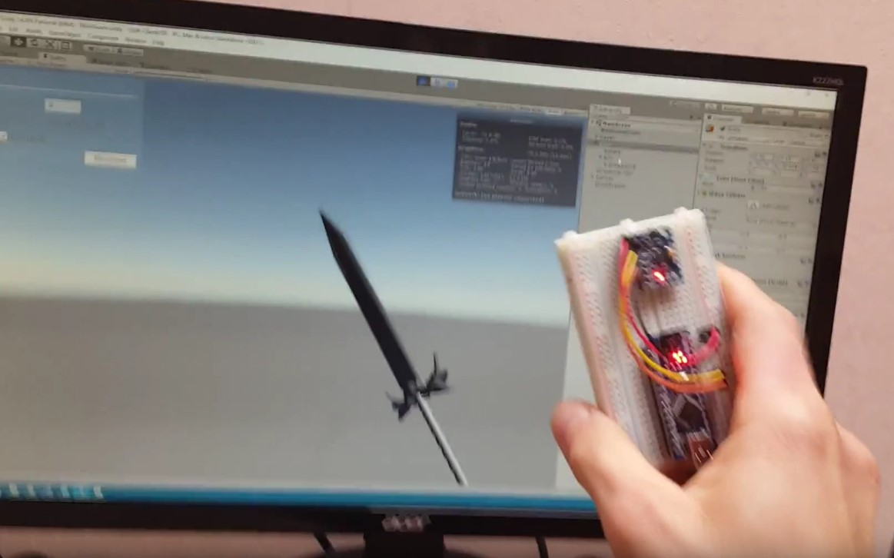

# OSS-CtrlR

This repository contains schemas, sources and documentation to build a DIY 3 DOF controllers. It's also planned to build an inertial suit using many IMUs.

Building a controller is simple because it uses standard components that everyone can buy for cheap on the internet.
The main board is composed of
- An Arduino Nano
- An IMU MPU 6050
- A bluetooth HM05 module *
- An analogic stick
- Few digital buttons

* The bluetooth code is not yet implemented.

